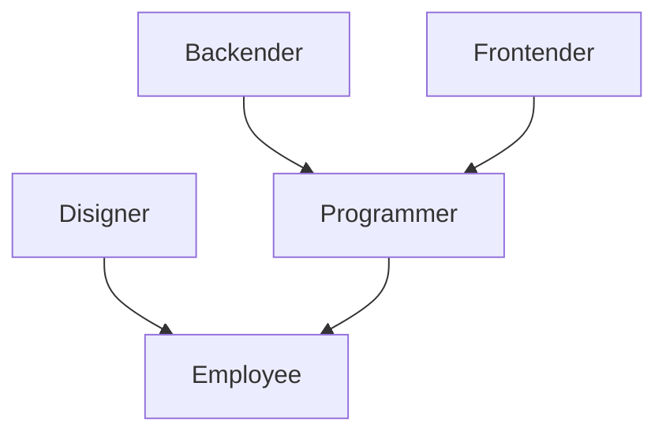

# Use case контрвариативности (Lab №2)

## Информация
Данный проект является практической работой по программированию, выданной в на курсе **Kotlin FullStack Developer**

## Техническое задание

Придумать и разработать use case с применением контрвариативности

## Описание use case

### Иерархия классов

### Описание

***People*** - класс, использующий контрвариативный принцип.
Класс содержит 1 поле и 2 метода:
- *item* - экземпляр класса, который был подставлен вместо Generics
- `printInfo` - при удачном cast`е к **Employee** выводится информация об *item*
- `work` - осуществляется проверка на соответствие классам из ранее описанной иерархии классов: если удачно - вызывается метод `work` у объекта класса, если нет - сообщение об ошибке

Для осуществления проверки и тестирования созданы экземпляры **People** для каждого экземпляра класса иерархии. Далее вызываются ранее описанные методы `work` и `printInfo`

## Команда
- [Воронов Александр](https://github.com/sanai1)
